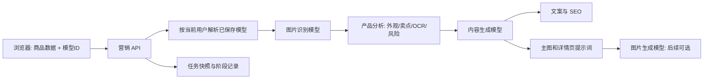

# 营销助手模型分工与路由方案

## 1. 背景

营销助手会执行两类本质不同的 AI 任务：

1. 理解商品图片，提取外观、材质、结构、包装、可见文字和风险信息。
2. 基于产品分析生成标题、卖点、SEO、主图提示词和详情页提示词。

视觉理解必须使用支持图片输入的文字模型；图片生成模型不能用于产品分析。文案与提示词生成则更关注中文写作、结构化输出和成本。因此，营销任务不能继续依赖单一的临时 `config`，而应按角色引用用户在设置页保存的模型。

## 2. 目标与边界

- 首页可分别选择图片识别模型与内容生成模型，并清楚显示本次任务的模型来源。
- 设置页是模型配置、能力标签和启用状态的唯一维护入口；营销助手只能引用当前用户已保存且可用的模型。
- 浏览器只提交模型 ID 和商品任务数据，绝不提交 API Key、Base URL、模型名或临时连接配置。
- 服务端按当前登录用户解析模型、执行能力校验，并将密钥仅用于服务端调用。
- 任务保存不可变模型快照和分阶段执行记录，保证历史可追溯、失败可定位、重试不重复消耗已完成步骤。
- 对模型能力不匹配给出执行前提示，不再把配置问题表现为笼统的 JSON 解析失败。

非目标：第一期不引入独立 OCR 服务，也不在营销首页直接生成图片；图片生成闭环在后续阶段接入。

## 3. 模型角色

| 角色 | 负责模块 | 必需能力 | 可选 ToAPI 示例 |
| --- | --- | --- | --- |
| 图片识别模型 | 产品分析、商品图 OCR、外观锁定、风险识别 | 视觉输入、稳定 JSON 输出 | `gpt-5.6-terra`、`gpt-5.6-sol`、`claude-sonnet-4-6` |
| 内容生成模型 | 文案、SEO、主图提示词、详情页提示词 | 中文写作、结构化输出 | `gpt-5.6-terra`、`gpt-5.6-luna`、`qwen3-max` |
| 图片生成模型 | 将提示词生成实际图片 | 文生图或图生图 | `gpt-image-2`、Seedream 等 |

### 关于文字识别

第一期不单独增加“识别文字模型”。OCR 由图片识别模型在产品分析时输出 `visibleText`；只有在需要批量识别、文字坐标或版面结构等高精度能力时，再接入专用 OCR 服务。这样首页保持两个必要选择，避免用户面对三个近似概念。

## 4. 统一模型配置与安全边界

### 4.1 服务端模型库

现有文本模型配置保存在浏览器 `localStorage`，服务端无法安全地按模型 ID 读取它，因此不能作为营销 API 的最终配置来源。第一步需要建立按用户隔离的服务端模型库；可扩展现有 `Config` 数据模型，或新建支持多条记录的 `ModelConfig` 数据模型。

每条模型配置至少包含：

```ts
interface ModelCapabilities {
  vision: boolean;
  jsonMode: boolean;
  ocr: boolean;
  imageGeneration: boolean;
}

interface SavedModelConfig {
  id: string;
  userId: string;
  name: string;
  provider: string;
  baseURL: string;
  model: string;
  encryptedApiKey: string;
  capabilities: ModelCapabilities;
  isActive: boolean;
  createdAt: string;
  updatedAt: string;
}
```

`encryptedApiKey` 只在服务端加解密，不能通过读取接口返回给浏览器，也不能写入营销任务快照、日志或错误信息。设置页只能读取掩码后的密钥状态，并经由专用接口更新模型配置。

### 4.2 授权与解析规则

营销生成接口必须通过当前登录用户识别调用者，不能再使用数据库中的第一个用户作为默认用户。服务端收到模型 ID 后按以下顺序处理：

1. 查询 `userId = 当前用户` 且 `id = 模型 ID` 的启用配置。
2. 找不到、无权限、已停用时返回 400，不发起模型调用。
3. 图片识别模型必须具备 `vision: true`；图片/视频生成模型不能承担识图角色。
4. 内容模型必须具备 `jsonMode: true`，不满足时给出明确配置提示。
5. 服务端解密 API Key，构造仅在内存中使用的运行时配置，并调用对应引擎。

前端传入任意 `config`、`apiKey`、`baseURL`、`model` 字段均视为非法字段并拒绝，避免密钥暴露和任意目标地址调用。

### 4.3 现有配置迁移

- 首次升级时读取浏览器中的旧配置，提示用户逐条确认后提交到服务端模型库；不静默上传密钥。
- 迁移完成前，营销助手显示“请在设置中保存模型”，不再回退使用本地临时配置。
- 旧的“文本模型覆盖”自由输入框必须删除，接口同步停止兼容该字段。

## 5. 首页交互设计

在营销助手“商品信息”步骤顶部新增紧凑的“本次任务模型”区块。

| 控件 | 数据来源 | 默认值 | 行为 |
| --- | --- | --- | --- |
| 图片识别模型 | 当前用户已保存、启用且 `vision: true` 的文本模型 | 激活的视觉模型 | 用于产品分析和 OCR |
| 内容生成模型 | 当前用户已保存、启用且 `jsonMode: true` 的文本模型 | 默认跟随图片识别模型 | 用于文案、SEO、主图和详情页提示词 |
| 跟随图片识别模型 | 页面交互状态 | 开启 | 开启时禁用内容模型下拉，并将其值同步为识图模型 |

交互规则：

1. 下拉项显示“配置名称 / 实际模型名 / 能力标签”，例如 `ToAPI 视觉主力 · gpt-5.6-terra · 视觉`。
2. 未找到视觉模型时，显示可操作提示并跳转设置页；不允许开始生成。
3. 用户关闭跟随后可单独选择内容模型；再次开启时立即覆盖为当前图片识别模型。
4. 不提供模型名称、Base URL 或密钥的自由输入。
5. 服务端是最终校验方；即使绕过界面提交，也不能选择无权限或能力不匹配的模型。

## 6. 请求契约与执行数据流



浏览器请求只包含模型 ID。跟随开关仅用于页面交互，不应作为服务端决策依据；开启时前端将两个 ID 同步为同一个值。

```ts
interface MarketingModelSelection {
  visionModelId: string;
  contentModelId: string;
}

interface MarketingTaskInput {
  // 既有商品、平台和输出字段
  modelSelection: MarketingModelSelection;
}
```

服务端将 `visionModelId` 解析为 `visionConfig`，仅传给 `ProductAnalyzer`；将 `contentModelId` 解析为 `contentConfig`，仅传给 `CopywritingEngine` 与 `PromptEngine`。接口不再接收统一 `config` 字段。

## 7. 任务追溯、阶段状态与重试

`MarketingTask` 除整体状态外，应新增下列不可变数据：

```ts
modelSnapshot Json?     // 两个角色的非敏感配置快照
executionSteps Json?    // 每个阶段的运行记录
```

模型快照保存 ID、配置名称、提供商、实际模型名、Base URL 和能力标签，严禁保存 API Key。`executionSteps` 以阶段为粒度记录 `analysis`、`copywriting`、`mainPrompts`、`detailPrompts` 的状态、模型角色、开始/结束时间、耗时、请求 ID、重试次数和已脱敏错误摘要。

执行规则：

1. 创建任务时同时写入模型快照和各阶段 `pending` 状态。
2. 每个阶段成功后立即持久化结果和阶段状态，避免后续失败丢失已完成产物。
3. 重试仅执行失败或未完成阶段；已经成功的产品分析不重复调用。
4. 结果页展示两类模型和阶段错误，但不展示密钥、完整请求体或原始敏感响应。

## 8. 分阶段实施

### 阶段 0：模型配置服务化

- 建立按用户隔离、可保存多条模型的服务端模型库，并为 API Key 配置服务端加密。
- 设置页改为调用模型配置接口；完成旧 `localStorage` 配置的显式迁移引导。
- 为模型配置增加 `vision`、`jsonMode`、`ocr`、`imageGeneration` 能力标签和 ToAPI 预设。
- 引入当前用户鉴权；停止营销接口使用 `findFirst()` 获取默认用户。

验收：浏览器无法读取已保存模型的明文密钥；不同用户不能读取或使用对方模型；服务端能仅凭模型 ID 获取当前用户的可用模型。

### 阶段 1：双模型路由 MVP

- 首页新增图片识别模型、内容生成模型和跟随开关。
- 移除平台配置中的自由文本“模型覆盖”，营销 API 停止接收 `config`。
- API 分别向产品分析与内容生成引擎注入解析后的 `visionConfig`、`contentConfig`。
- 前后端同时校验模型能力，阻止图片生成模型用于识图。
- 创建任务时保存模型快照。

验收：同一任务可选择 Terra 做识图、Luna 做文案；手工伪造模型 ID、传入临时 `config` 或选择无视觉能力模型均无法提交；历史任务能显示当时使用的模型。

### 阶段 2：OCR 与可观测性

- 在产品分析类型、提示词模板和结果页增加“图片可见文字”字段，区分模型识别文字与模型推断卖点。
- 增加阶段执行记录、耗时、请求 ID、脱敏错误和按阶段重试。
- 将 JSON 解析失败关联到具体模型和阶段，保留受控的原始响应诊断信息。

验收：任务失败能定位到具体模型阶段；重试文案生成时不重新执行图片分析；结果页可区分 OCR 结果和推断卖点。

### 阶段 3：图片生成闭环

- 从主图/详情页提示词一键发起图片模型任务。
- 图片模型同样只从当前用户保存且启用的图片模型中选择。
- 支持对每张图单独选择图片模型与比例，并将生成图片回写资产库和营销任务。

验收：营销助手可完成“商品图识别 → 文案和提示词 → 图片生成 → 素材入库”的闭环，并可追溯每张图的模型配置快照。

## 9. 风险与决策

| 风险 | 处理方式 |
| --- | --- |
| 客户端泄露密钥或提交任意 Base URL | 模型配置服务端保存；接口只接受模型 ID 并拒绝 `config` 类字段 |
| 越权使用他人模型 | 基于当前用户查询模型配置，缺失或不属于当前用户即拒绝 |
| 用户误把图片生成模型用于分析 | 下拉过滤，后端按能力标签二次拦截 |
| 不同模型返回 JSON 不稳定 | `jsonMode` 能力标签、结构化输出、解析修复、受控诊断日志 |
| 模型修改后历史结果无法解释 | 保存不含密钥的模型快照和阶段调用记录 |
| 两个模型增加选择负担 | 默认跟随，只在有必要时拆分 |

## 10. 最终决策

营销助手第一期采用“双模型”方案：图片识别模型 + 内容生成模型；OCR 不单列模型，作为图片识别模型的能力和结果字段。图片模型保留给后续“提示词直接生成图片”闭环使用。

实施顺序必须先完成阶段 0。只有在模型配置可由服务端按当前用户安全解析后，双模型路由才能满足“只使用设置页已保存模型”的产品要求。
