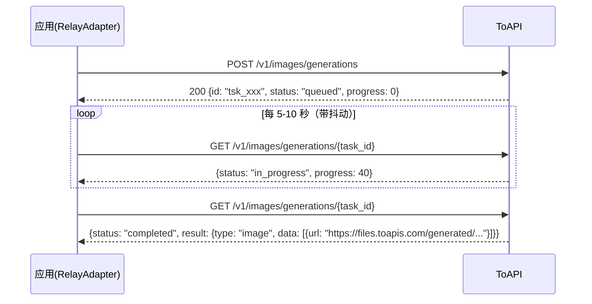

# ToAPI 异步任务模式集成文档

## 1. 概述

[ToAPI](https://docs.toapis.com)（toapis.com）是一个商业 AI 中转站，支持 `gpt-image-2`、Gemini、Seedream、Flux、Grok 等多种图片生成模型。

与标准 OpenAI 兼容中转站（同步返回图片）不同，**ToAPI 的所有图片接口都是异步任务模式**：提交请求后立即返回一个任务对象（`task_id`），需要轮询任务状态接口直到 `completed` 才能拿到图片 URL。

本文档记录本项目中 ToAPI 异步任务模式的接入逻辑（`src/lib/ai/adapters/relay.ts`），以及配置、调试与限制说明。

> 官方文档：<https://docs.toapis.com/docs/cn/api-reference/images/gpt-image-2/generation>

---

## 2. 问题背景

项目最初按标准 OpenAI 同步格式接入中转站，接入 ToAPI 后出现两个依次暴露的问题：

### 2.1 无效的令牌（401）

```
[API] Text-to-image error: Error: Relay API error: 无效的令牌 (request id: ...)
POST /api/ai/text-to-image 500
```

- **原因**：设置中配置的 API Key 不属于 ToAPI（或已过期）
- **解决**：在 <https://toapis.com/console/token> 创建新密钥，填入设置页

### 2.2 Relay API returned no images

```
[Queue] Error: Error: Relay API returned no images
    at RelayAdapter.parseImageResponse (src\lib\ai\adapters\relay.ts:149)
```

- **原因**：密钥已通过，但 ToAPI 的 `POST /v1/images/generations` 返回的是**任务对象**（`{id, status: "queued", progress: 0}`），响应里根本没有图片字段；而适配器按同步格式解析（`data[].url` / `data[].b64_json` / `data.images[]`），解析不到任何图片
- **本质**：接口模式不兼容，**无法通过改配置解决，必须改造适配器**（详见第 4 节）

---

## 3. ToAPI 图片 API 规范

### 3.1 异步任务模型



**要点**：

| 项目 | 说明 |
|------|------|
| 提交端点 | `POST https://toapis.com/v1/images/generations` |
| 状态端点 | `GET https://toapis.com/v1/images/generations/{task_id}` |
| 状态流转 | `queued` → `in_progress` → `completed` / `failed` |
| 轮询间隔 | 至少 5-10 秒，建议加入随机抖动 |
| 最大等待 | 约 120 秒（典型耗时 5-30 秒） |
| 图片位置 | 完成时在 `result.data[0].url`（有效期 24 小时） |
| 认证 | `Authorization: Bearer YOUR_API_KEY` |

**提交响应（200，立即返回）**：

```json
{
  "id": "tsk_img_abc123def456",
  "object": "generation.task",
  "model": "gpt-image-2",
  "status": "queued",
  "progress": 0,
  "created_at": 1703884800,
  "metadata": {}
}
```

**完成响应**：

```json
{
  "id": "img_xxx",
  "object": "generation.task",
  "model": "gpt-image-2",
  "status": "completed",
  "progress": 100,
  "completed_at": 1768381063,
  "result": {
    "type": "image",
    "data": [
      { "url": "https://files.toapis.com/generated/xxx.png" }
    ]
  }
}
```

### 3.2 请求参数

```json
{
  "model": "gpt-image-2",
  "prompt": "商品主图，白色背景",
  "n": 1,
  "size": "1:1",
  "resolution": "1k",
  "response_format": "url"
}
```

| 参数 | 说明 |
|------|------|
| `size` | 13 种比例字符串：`1:1` `3:2` `2:3` `4:3` `3:4` `5:4` `4:5` `16:9` `9:16` `2:1` `1:2` `21:9` `9:21`（**不是**像素尺寸） |
| `resolution` | `1k` / `2k` / `4k` 三档 |
| `response_format` | 仅 `url` |

**注意**：4k 分辨率只支持 6 种比例：`16:9`、`9:16`、`2:1`、`1:2`、`21:9`、`9:21`。

### 3.3 图生图（编辑模式）

- 与生成共用同一端点 `POST /v1/images/generations`
- 请求体包含 `image_urls`（公网 URL 数组，最多 16 张，PNG/JPG ≤ 50MB）即自动切换为编辑模式
- **不支持 base64**：图片需先上传得到公网 URL，或用 `mask_url` 做局部重绘
- 同样为异步任务，需轮询

### 3.4 图片上传接口

- `POST https://toapis.com/v1/uploads/images`（multipart/form-data，字段名 `file`，可选 `purpose`，默认 `generation`）
- 支持 JPEG/PNG/WebP/GIF，最大 10MB
- 响应：`{success: true, data: {url: "https://..."}}`
- 上传一次，URL 可多次使用

---

## 4. 适配器实现（`src/lib/ai/adapters/relay.ts`）

### 4.1 设计原则

1. **自动检测**：`baseURL` 含 `toapis.com` 时启用 ToAPI 模式，其他中转站行为完全不变
2. **兼容优先**：同步响应的中转站走原逻辑；只有响应体形似任务对象（有 `id` + `status`/`object: "generation.task"`）时才走异步轮询
3. **失败快速**：401/403/400 属配置错误，立即抛出；429/5xx 视为任务仍在处理，继续轮询

### 4.2 关键逻辑

#### 常量与工具方法

```typescript
// 轮询参数（官方文档建议 5-10 秒 + 抖动，最长 120 秒）
const TASK_POLL_INTERVAL_MS = 5000;
const TASK_POLL_TIMEOUT_MS = 120000;

// 支持的 13 种比例（size 参数）
const TOAPI_RATIOS = ['1:1', '3:2', '2:3', '4:3', '3:4', '5:4', '4:5',
                      '16:9', '9:16', '2:1', '1:2', '21:9', '9:21'];

// 4k 分辨率仅支持 6 种比例
const TOAPI_4K_RATIOS = new Set(['16:9', '9:16', '2:1', '1:2', '21:9', '9:21']);

private isToAPI(): boolean {
  return /toapis\.com/i.test(this.baseURL);
}
```

#### 尺寸转换：像素 → 比例 + 分辨率

```typescript
private toAPISize(width: number, height: number): { size: string; resolution: string } {
  // 1. 计算宽高比，从 13 种比例中选最接近的
  const aspect = width / height;
  // ... 遍历 TOAPI_RATIOS，取 |aspect - w/h| 最小者

  // 2. 按长边映射分辨率：≥3072 → 4k；≥1536 → 2k；否则 1k
  const longEdge = Math.max(width, height);
  let resolution = longEdge >= 3072 ? '4k' : longEdge >= 1536 ? '2k' : '1k';

  // 3. 该比例不支持 4k 时降级为 2k（保持比例）
  if (resolution === '4k' && !TOAPI_4K_RATIOS.has(ratio)) {
    resolution = '2k';
  }
  return { size: ratio, resolution };
}
```

**项目预设尺寸映射验证**：

| 分辨率 | 预设尺寸 | 转换结果 |
|--------|----------|----------|
| 1K | 1024×1024 | `1:1` + `1k` |
| 1K | 1344×768 | `16:9` + `1k` |
| 1K | 896×1152 | `3:4` + `1k` |
| 2K | 2048×2048 | `1:1` + `2k` |
| 2K | 2688×1536 | `16:9` + `2k` |
| 4K | 4096×4096 | `1:1` + `2k`（4k 不支持 1:1，降级） |
| 4K | 5376×3072 | `16:9` + `4k` |

#### 异步任务轮询

```typescript
private async pollImageTask(taskId: string): Promise<string[]> {
  const startedAt = Date.now();
  let lastError = '';

  while (Date.now() - startedAt < TASK_POLL_TIMEOUT_MS) {
    await this.sleep(TASK_POLL_INTERVAL_MS + Math.random() * 1000); // 抖动

    for (const endpoint of this.endpoints(`/images/generations/${taskId}`)) {
      const response = await fetch(endpoint, {
        method: 'GET',
        headers: { 'Authorization': `Bearer ${this.config.apiKey}`, 'Content-Type': 'application/json' },
      });

      if (response.ok) {
        const data = await response.json();
        if (data.status === 'completed') return this.parseTaskResult(data);
        if (data.status === 'failed') {
          throw new Error(`Relay API task failed: ${data.error?.message || data.message || 'unknown error'}`);
        }
        break; // queued / in_progress：继续轮询
      }

      lastError = await this.readApiError(response);
      // 密钥/参数错误立即抛出，不空等
      if ([401, 403, 400].includes(response.status)) {
        throw new Error(`Relay API error: ${lastError}`);
      }
      // 404/405 换候选地址；其余错误（429/5xx）视为处理中
      if (response.status !== 404 && response.status !== 405) break;
    }
  }

  throw new Error(`Relay API task timed out: ...`);
}
```

#### 任务结果解析

```typescript
private parseTaskResult(data: any): string[] {
  // ToAPI：result.data[].url
  if (Array.isArray(data?.result?.data)) {
    const images = data.result.data
      .map((item: any) => item?.url || item?.b64_json)
      .filter((v) => typeof v === 'string' && v.length > 0);
    if (images.length > 0) return images;
  }
  // 兜底：部分中转站轮询结果直接是标准 OpenAI 格式
  return this.parseImageResponse(data);
}
```

#### 文生图主流程

```typescript
private async textToImageOpenAI(params: TextToImageParams): Promise<string[]> {
  const isToAPI = this.isToAPI();
  const body = JSON.stringify({
    model: this.config.model || 'dall-e-3',
    prompt: params.prompt,
    n: params.samples,
    // ToAPI 用比例+分辨率，标准 OpenAI 兼容接口用像素尺寸
    ...(isToAPI ? this.toAPISize(params.width, params.height) : { size: `${params.width}x${params.height}` }),
    response_format: 'url',
  });
  // ... POST 到 /images/generations（根地址与 /v1 地址自动回退）

  if (response.ok) {
    const data = await response.json();
    // 形似任务对象 → 异步轮询；否则按同步格式解析
    if (data && typeof data.id === 'string' && (data.status || data.object === 'generation.task')) {
      return await this.pollImageTask(data.id);
    }
    return this.parseImageResponse(data);
  }
  // ...
}
```

#### 图生图（ToAPI 编辑模式）

```typescript
private async imageToImageToAPI(params: ImageToImageParams): Promise<string[]> {
  // 1. base64 需先上传换公网 URL（上传接口 /v1/uploads/images）
  let imageUrl = params.image;
  if (imageUrl.startsWith('data:')) {
    imageUrl = await this.uploadImage(imageUrl);
  }

  // 2. JSON 请求：image_urls 触发编辑模式，同 generations 端点
  const body = JSON.stringify({
    model: this.config.model || 'gpt-image-2',
    prompt: params.prompt,
    n: params.samples,
    image_urls: [imageUrl],
    ...this.toAPISize(params.width, params.height),
    response_format: 'url',
  });

  // 3. 提交后同样走 pollImageTask 轮询
}
```

### 4.3 端点候选策略

```typescript
// 根地址和 /v1 地址都很常见；仅当 baseURL 不以 /v1 结尾时保留回退候选
private endpoints(path: string): string[] {
  const primary = `${this.baseURL}${path}`;
  if (/\/v1$/i.test(this.baseURL)) return [primary];
  return [primary, `${this.baseURL}/v1${path}`];
}
```

---

## 5. 配置指南

### 5.1 设置页填写

| 设置字段 | 填写内容 |
|----------|----------|
| 服务类型 | 中转站（relay） |
| 名称 | 任意，如 `ToAPI` |
| API Key | <https://toapis.com/console/token> 创建 |
| Base URL | **`https://toapis.com/v1`**（必须带 `/v1`，见 5.2） |
| 中转站类型 | **OpenAI 格式** |
| 模型 | `gpt-image-2` |
| 最大并发数 | 默认 50 |

### 5.2 为什么 Base URL 要带 `/v1`

- 带 `/v1`：图片请求直达 `https://toapis.com/v1/images/generations`，**测试连接**（`GET /v1/models`）也能通过
- 不带 `/v1`：生成会通过候选地址回退成功，但测试连接请求 `https://toapis.com/models` 返回 404，**测试按钮会误报失败**

---

## 6. 验证与测试

### 6.1 端点冒烟测试（无需真实密钥）

```bash
# 应返回 401 + 标准错误 JSON（说明路径存在、认证生效）
curl -X POST https://toapis.com/v1/images/generations \
  -H "Authorization: Bearer sk-invalid-test" \
  -H "Content-Type: application/json" \
  -d '{"model":"gpt-image-2","prompt":"test"}'

curl -o /dev/null -w "%{http_code}" https://toapis.com/v1/models \
  -H "Authorization: Bearer sk-invalid-test"   # → 401
```

### 6.2 全链路验证（真实密钥）

1. 设置页保存 ToAPI 配置 → 点"测试连接"应通过
2. 文生图页面生成 → 日志中出现：

```
[Queue] Task xxx completed (attempt 1)                       ← 异步任务轮询成功
[FileStorage] Thumbnail generated: xxx_thumb.png
[FileStorage] File saved: user-data\xxx.png
POST /api/ai/text-to-image 200 in 83s                        ← 200（83s 含排队+生成+轮询）
```

3. 图生图页面 / 工作流"回传图片输入"链路 → 验证 `image_urls` 编辑模式

---

## 7. 限制与注意事项

| 事项 | 说明 |
|------|------|
| 生成耗时 | 单张典型 5-30 秒，排队高峰可达 80 秒+；轮询最长 120 秒，超时抛错 |
| 图片有效期 | ToAPI 返回的图片 URL 仅 24 小时有效，应用会立即下载落盘（`user-data/`），不受影响 |
| 4k 比例限制 | 4K 仅支持 16:9 / 9:16 / 2:1 / 1:2 / 21:9 / 9:21；1:1、4:3、3:4 等自动降级 2k |
| base64 图片 | 图生图必须用公网 URL，base64 自动经 `/v1/uploads/images` 上传（≤10MB） |
| 尺寸参数 | ToAPI 用比例 `1:1` 而非像素 `1024x1024`；像素转比例按最接近匹配 |
| 测试连接 | 依赖 `GET /v1/models`，baseURL 不带 `/v1` 会误报失败 |
| 轮询抖动 | 间隔 `5000 + random()*1000` 毫秒，符合官方"5-10 秒加抖动"建议 |

---

## 8. 参考资料

- ToAPI gpt-image-2 生成文档：<https://docs.toapis.com/docs/cn/api-reference/images/gpt-image-2/generation>
- ToAPI 任务状态查询：<https://docs.toapis.com/docs/cn/api-reference/tasks/image-status>
- ToAPI 图片上传：<https://docs.toapis.com/docs/cn/api-reference/uploads/images>
- ToAPI 全量接口索引：<https://docs.toapis.com/llms.txt>
- 代码位置：`src/lib/ai/adapters/relay.ts`

---

**文档版本**：v1.0  
**创建日期**：2026-08-12  
**维护人员**：技术团队
